# PantryPal — Android Recipe App

> A personalised recipe discovery app for Android — built with Kotlin, Jetpack Compose, Firebase, and Spoonacular API.

PantryPal helps users discover recipes using ingredients they already have, with onboarding-driven personalisation, search + filters, recipe details, and skill-building resources.

  ## ⚠️ Attribution
 **The sections below highlight my personal contributions to PantryPal.**  

---

## Screenshots

### Onboarding
<p align="center">
  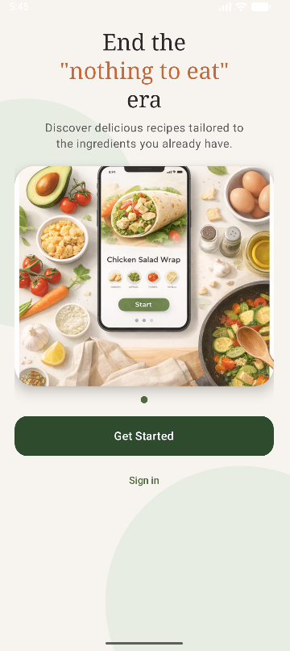
  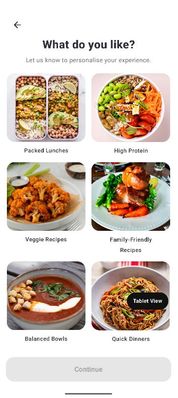
  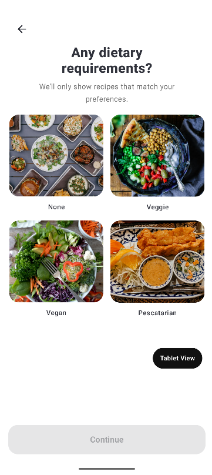
  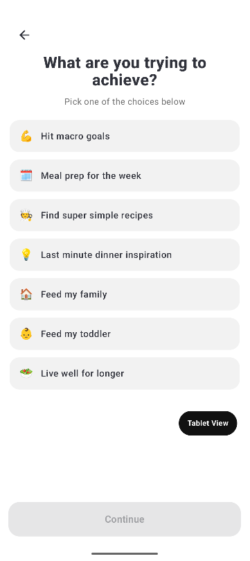
  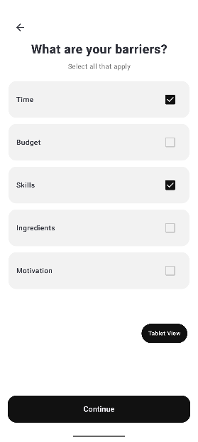
</p>

### Core app screens
<p align="center">
  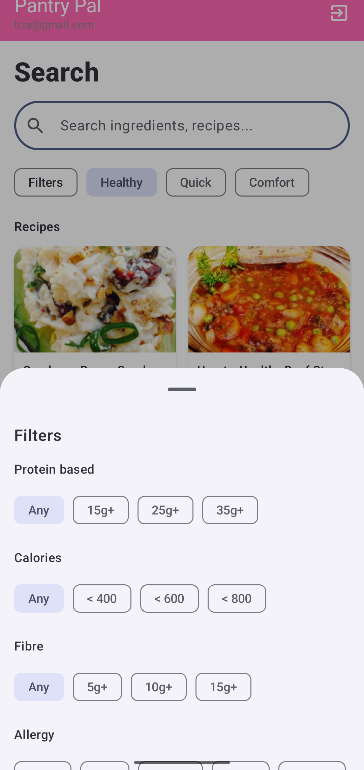
  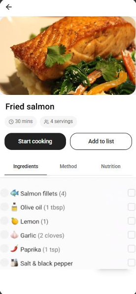
  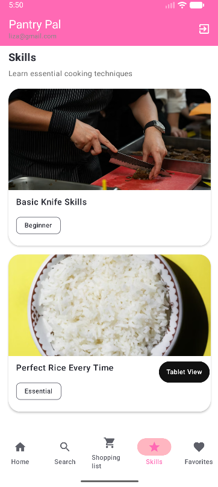
</p>

---

## What the app does

**Onboarding** — A multi-step flow captures user goals, dietary preferences, and cooking barriers to personalise the experience. Selections persist across steps via shared state.

**Recipe discovery and search** — Users search for recipes using the Spoonacular API and refine results with filters. Recipes open into a detail view with ingredients, method, and nutrition information.

**Skills and support** — A Skills section provides cooking technique resources and opens YouTube tutorials directly from the app.

**Shopping list** — Add ingredients manually or pull them automatically from a recipe.

**Authentication** — Firebase login and registration with secure user accounts.

---

## Tech stack
- Kotlin
- Jetpack Compose
- Firebase Authentication + Firestore
- Spoonacular API
- ViewModel-based UI state (MVVM)
- Room DB (local storage)

---

## Design and planning

UI/UX designed in Figma — wireframes, a consistent layout system, and high-fidelity composites produced before implementation.

<p align="center">
  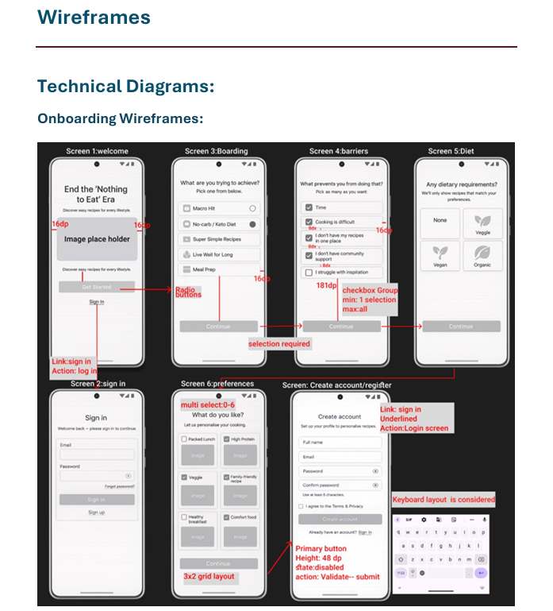
  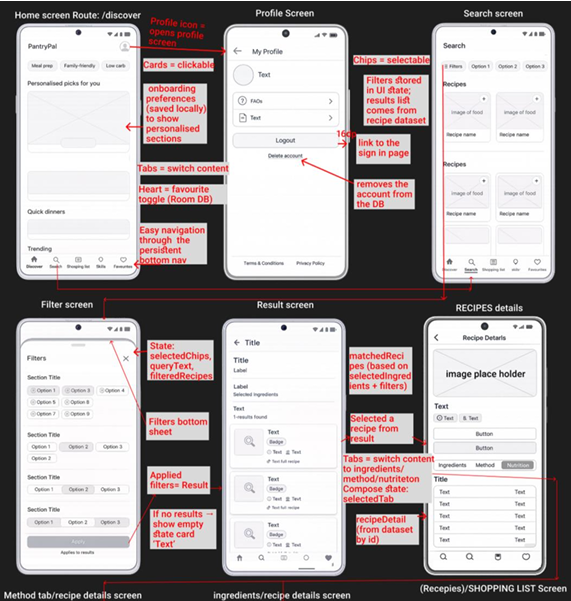
  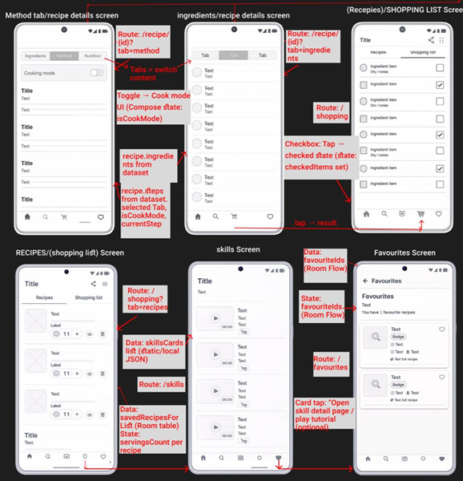
  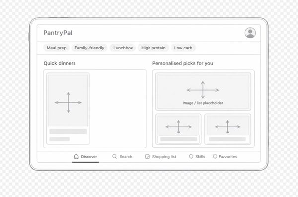
</p>

---

## My contributions (Maedeh Golmohammadi)

My contributions in details:

**Design**
- Produced low-fidelity wireframes and a consistent layout system across all screens (spacing, sizing, alignment)
- Created high-fidelity composite screens and reusable component patterns (chips, cards, bottom navigation, buttons, tabs)
- Planned and documented the end-to-end user journey (onboarding → authentication → main screens) and interaction behaviour

**Jetpack Compose implementation**
- Built all 6 onboarding screens as separate Composables (welcome, goals, barriers, dietary, preferences)
- Implemented `OnboardingViewModel` + `OnboardingAnswers` data model to persist selections across the onboarding flow
- Built the Search screen using Spoonacular `complexSearch`, including a filters bottom sheet and search bar
- Built the Skills screen with card-based layout and YouTube Intent on tap

---

## Contributors
- **Sultan Ali** — project setup, Firebase auth, home screen, Spoonacular integration, navigation
- **Mundhir Ahmed** — login/register screens, shopping list, profile page, app icon
- **Maedeh Golmohammadi** — UI/UX design system, wireframes, composites, onboarding (Compose + state), search + filters, skills screen

---

## Getting started

### Prerequisites
- Android Studio (recent version)
- Android SDK 24+
- Spoonacular API key
- Firebase project with Authentication enabled

### Setup
```bash
git clone https://github.com/Liza-golmohammadi/pantrypal-android.git
cd pantrypal-android
```

1. Add your Spoonacular API key to `local.properties`:
```
SPOONACULAR_API_KEY=your_key_here
```
2. Add your `google-services.json` from Firebase to the `/app` directory
3. Open in Android Studio and run

---

*University project — UWE Bristol, 2024/25*
